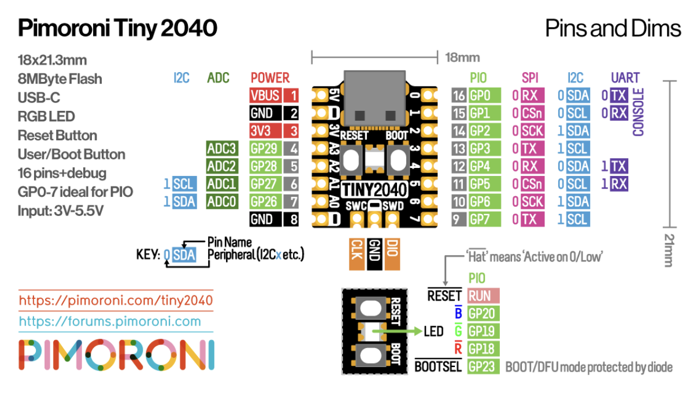
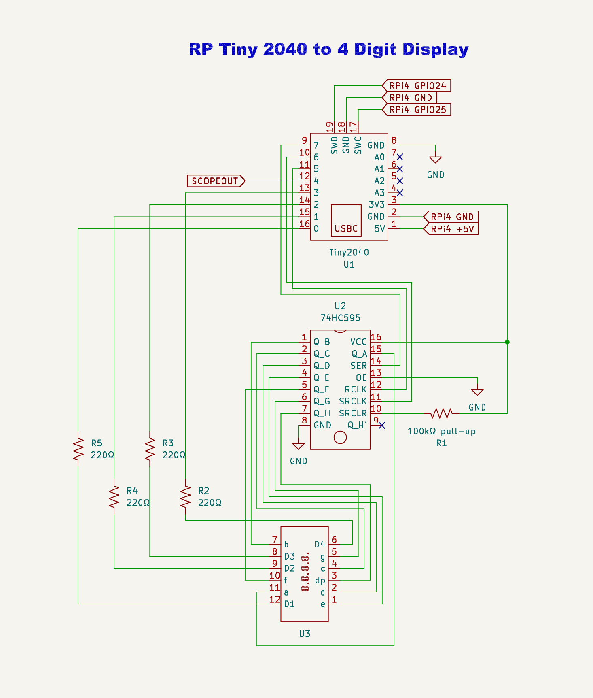

# Tiny2040 7-Segment Counter


A free-running counter built on the RP2040-based Pimoroni Tiny2040, driving a 4-digit common-cathode 7-segment display through a 74HC595 shift register using the Raspberry Pi Pico C/C++ SDK. Adapted from an older Arduino reference project (David Frame, UVU) and ported to the RP2040.

## Demo

https://github.com/user-attachments/assets/0b9b1ace-705c-43bc-a872-abcbfa2ae66c


## How It Works

The Tiny2040 shifts an 8-bit segment pattern into a 74HC595 shift register, then rapidly multiplexes through all 4 digits — enabling one digit's common cathode at a time while updating the shift register's output — fast enough that persistence of vision makes all 4 digits appear lit simultaneously.

A counter increments roughly every 10ms and wraps back to 0 after reaching 9999. A decimal point is lit after the 2nd digit, formatting the readout as `XX.XX`. A separate GPIO (`SCOPEOUT`) toggles once per tick purely as an oscilloscope test point, letting the actual loop timing be verified against the intended ~10ms interval — it isn't wired to the display.

## Hardware

### Pimoroni Tiny2040 Pinout



Built and wired against the schematic below.



| Component | GPIO |
|---|:---:|
| 74HC595 RCLK (latch) | 5 |
| 74HC595 SRCLK (clock) | 6 |
| 74HC595 SER (data) | 7 |
| Digit 1 (thousands) enable | 0 |
| Digit 2 (hundreds) enable | 1 |
| Digit 3 (tens) enable | 2 |
| Digit 4 (ones) enable | 3 |
| Scope test pin (debug only) | 4 |

The 74HC595's `OE` pin is tied to GND (outputs always enabled) and `SRCLR` is pulled up to 3.3V through a 100kΩ resistor (never reset). Its 8 outputs (QA–QH) drive the display's 8 segment pins directly, and each of the 4 digit-common pins is driven through a 220Ω resistor from the Tiny2040.

## Building & Flashing

**Requirements:** [Raspberry Pi Pico C/C++ SDK](https://github.com/raspberrypi/pico-sdk), CMake, and an ARM GCC embedded toolchain (`arm-none-eabi-gcc`). Set the `PICO_SDK_PATH` environment variable to point at your SDK checkout.

Easiest path: open this repo in VS Code with the [CMake Tools](https://marketplace.visualstudio.com/items?itemName=ms-vscode.cmake-tools) extension installed, then run **CMake: Build** — it handles the configure and compile for you.

Manual build:

```bash
git clone https://github.com/olael94/tiny2040-7seg-counter.git
cd tiny2040-7seg-counter
mkdir build && cd build
cmake ..
make
```

To flash: hold BOOTSEL on the Tiny2040 while plugging it into USB, then drag build/Picoto4Digitdisplay2.uf2 onto the drive that appears.

## Project Structure

Picoto4Digitdisplay2.c                — GPIO setup, shift-register bit-banging, and display multiplexing logic
CMakeLists.txt                        — build configuration
pico_sdk_import.cmake                 — pulls in the Pico SDK
PicoToFourDigitDisplay-Schematic.png  — circuit schematic
Tiny2040-Pinout.png                   — Tiny2040 pinout reference

https://github.com/user-attachments/assets/9ca1bfe4-469d-40ac-a018-f60d6633c589

